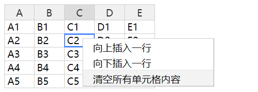

# HandsonTable

## 一、安装

* 项目中直接引入handsontablen的依赖

``` shell
yarn add handsontable，
```

* 在react项目中需要引入

``` shell
yarn add @handsontable/react
```

* 在根组件需要引入handsontable的样式文件

```javascript
import 'handsontable/dist/handsontable.full.css';
```

## 二、开始上手 

* 在react项目中使用

```javascript
import React from 'react';
import { HotTable } from '@handsontable/react';

export default class App extends React.Component {
  constructor(props) {
    super(props);
    this.data = [
      ["", "Ford", "Volvo", "Toyota", "Honda"],
      ["2016", 10, 11, 12, 13],
      ["2017", 20, 11, 14, 13],
      ["2018", 30, 15, 12, 13]
    ];
  }

  render() {
    return (
      <div id="hot-app">
        <HotTable
            data={this.data} // 数据源
            colHeaders={true} // 是否显示列标题
            rowHeaders={true} // 是否显示行标题
            width="600" // 宽度 超出宽度默认出滚动条
            height="300" // 高度 超出高度默认出滚动条
        />
      </div>
    );
  }
}

```

* 不使用@handsonTable/react 提供的组件

``` javascript
import * as React from 'react';
import HandsonTable from 'handsontable';

export default class HandsonTableTest extends React.Component {
    constructor(props) {
        super(props);
        this.handTable = null;
    }
    componentDidMount() {
        if (this.handTable) {
            new HandsonTable(this.handTable, {
                data: HandsonTable.helper.createSpreadsheetData(5, 5),
                rowHeaders: true,
                colHeaders: true
            });
        }

    }
    render() {
        return (
            <div ref={(div) => this.handTable = div}></div>
        )
    }
}
```

<font color=red>*注意：</font>如果安装的是7.0版本以上的，会在表格下方提示一段购买商业许可证，所以还需要在加上licenseKey='non-commercial-and-evaluation',就不会再出现提示了。

```javascript
...
<HotTable
    data={this.data}
    colHeaders={true}
    rowHeaders={true}
    width="600"
    height="300"
    licenseKey='non-commercial-and-evaluation'
/>
```
## 三、基础的例子
 * 使用外部复选框控制表行为的交互式实现。
  在HotTable包装器中把配置项交给React的state控制，这样就能用外部事件来控制表格的交互。
```javascript
import React from 'react';
import { HotTable } from '@handsontable/react';
import Handsontable from 'handsontable';

export default class MyComponent extends React.Component {
  constructor(props) {
    super(props);
    this.state = {
      settings: {
        data: Handsontable.helper.createSpreadsheetData(15, 20),
        width: 570,
        height: 220,
      }
    }
  }

  handleChange = (setting, states) => {
    return (event) => {
      this.setState({
        settings: {
          [setting]: states[event.target.checked ? 1 : 0],
        }
      });
    }
  };

  render() {
    return (
      <div>
        <div className="controllers">
          <label><input onChange={this.handleChange('fixedRowsTop', [0, 2])} type="checkbox" />固定两行</label><br/>
          <label><input onChange={this.handleChange('fixedColumnsLeft', [0, 2])} type="checkbox" />固定两列</label><br/>
          <label><input onChange={this.handleChange('rowHeaders', [false, true])} type="checkbox" />显示/隐藏行标题</label><br/>
          <label><input onChange={this.handleChange('colHeaders', [false, true])} type="checkbox" />显示/隐藏列标题</label><br/>
        </div>
        <HotTable root="hot" settings={this.state.settings}/>
      </div>
    );
  }
}
```

* 添加右键菜单
``` javascript
  import React from 'react';
  import { HotTable } from '@handsontable/react';
  import Handsontable from 'handsontable';

  class App extends React.Component {
    constructor(props) {
      super(props);
      this.hotSettings = {
        data: Handsontable.helper.createSpreadsheetData(5, 5),
        colHeaders: true,
        contextMenu: {
          items: {
            'row_above': {
              name: '向上插入一行'
            },
            'row_below': {
              name:'向下插入一行'
            },
            // 分割线
            'separator': Handsontable.plugins.ContextMenu.SEPARATOR, 
            // 自定义事件
            'clear_custom': {
              name: '清空所有单元格内容',
              callback: function() {
                this.clear();
              }
            }
          }
        }
      };
    }

    render() {
      return (
        <div>
          <HotTable
            id="hot"
            settings={this.hotSettings}
          />
        </div>
      );
    }
  }
```
示例


* 自定义渲染单元格
``` javascript
  import React from 'react';
  import ReactDOM from 'react-dom';
  import { HotTable } from '@handsontable/react';
  import Handsontable from 'handsontable';

  class App extends React.Component {
    constructor(props) {
      super(props);
      this.hotSettings = {
        data:
          [['A1', 'https://handsontable.com/docs/images/examples/professional-javascript-developers-nicholas-zakas.jpg'],
            ['A2', 'https://handsontable.com/docs/images/examples/javascript-the-good-parts.jpg']],
        columns: [
          {},
          {
            renderer: function(instance, td, row, col, prop, value, cellProperties) {
              const escaped = Handsontable.helper.stringify(value);
              let img = null;

              if (escaped.indexOf('http') === 0) {
                img = document.createElement('IMG');
                img.src = value;

                Handsontable.dom.addEvent(img, 'mousedown', function(event) {
                  event.preventDefault();
                });

                Handsontable.dom.empty(td);
                td.appendChild(img);
              }
              else {
                Handsontable.renderers.TextRenderer.apply(this, arguments);
              }

              return td;
            }
          }
        ],
        colHeaders: true,
        rowHeights: 55
      };
    }

    render() {
      return (
        <div>
          <HotTable
            id="hot"
            settings={this.hotSettings}
          />
        </div>
      );
    }
  }

```
示例

例子中data和columns的关系是一一对应，A1,A2属于第一行的数据，没有做自定义渲染，在columns中就用 {} 占位。columns的第二个对象是一个render函数
```javascript
function(instance, td, row, col, prop, value, cellProperties) {}
// instance 是整个table的实例，可以使用handsontable的api
// td 是当前单元格td的DOM
// col 第几列
// row 第几行
// prop 数据的key值
// value 数据值
// cellProperties 前面几个参数的对象集合
```

* 获取handsontable的实例

```javascript
  import React from 'react';
  import ReactDOM from 'react-dom';
  import {HotTable} from '@handsontable/react';
  import Handsontable from 'handsontable';

  class App extends React.Component {
    constructor(props) {
      super(props);

      this.id = 'hot';
      this.hotSettings = {
        data: Handsontable.helper.createSpreadsheetData(4, 4),
        colHeaders: true
      };
      this.hotTableComponent = React.createRef();
    }

    swapHotData() {
      // The Handsontable instance is stored under the `hotInstance` property of the wrapper component.
      this.hotTableComponent.current.hotInstance.loadData([['new', 'data']]);
    }

    render() {
      return (
        <div>
          <HotTable ref={this.hotTableComponent} id={this.id} settings={this.hotSettings}/>
          <br/>
          <button onClick={this.swapHotData.bind(this)}>Load new data!</button>
        </div>
      );
    }
  }
```
在@handsontable/react提供包装器中获取ref，然后就可以在ref中获取到handsontable的实例，就可以使用handsontable提供api来控制表格的行为

## 四、表格常规配置介绍
  - data 表格的数据源，有两种格式
    - 数组的数据格式
    ```
    const data = [['', 'Tesla', 'Nissan', 'Toyota', 'Honda', 'Mazda', 'Ford'],
    ['2017', 10, 11, 12, 13, 15, 16],
    ['2018', 10, 11, 12, 13, 15, 16],
    ['2019', 10, 11, 12, 13, 15, 16],
    ['2020', 10, 11, 12, 13, 15, 16],
    ['2021', 10, 11, 12, 13, 15, 16]]
    ``` 
    示例
    
    
    - json对象格式的数据源
    ```
    const data = [
    {id: 1, name: 'Ted Right', address: ''},
    {id: 2, name: 'Frank Honest', address: ''},
    {id: 3, name: 'Joan Well', address: ''},
    {id: 4, name: 'Gail Polite', address: ''},
    {id: 5, name: 'Michael Fair', address: ''}]
    ```
    示例
    

１，冻结行列
1.1：fixedRowsTop　冻结行（固定顶部开始算起指定行不随垂直滚动条滚动；

1.2：fixedColumnsLeft　冻结列（固定右边开始算起指定行不随水平滚动条滚动）；

2，显示表头
2.1：colHeaders:true　显示列表头， 默认false， 可取 true/fals/数组 ，当值为数组时，列头为数组的值

2.2：rowHeaders:true　显示行表头， 默认 false， 可取 true/fals/数组，当值为数组时，行头为数组的值

3：允许通过拖曳行表头/列表头来改变行列的大小
3.1： manualColumnResize:true 允许拖曳列表头，默认为false

3.2： manualRowResize:true 允许拖曳行表头，默认为false

4：显示表头下拉菜单
4.1： contextMenu:true 显示表头的下拉菜单默认false 可取 true/false/自定义数组

5：手动设置冻结列
5.1：manualColumnFreeze:true  设置true后在单元格中右击出现一个菜单，此菜单会多出一个“Unfteeze this columu”的选项，再次点击就会取消冻结动作。 默认为false

6:给当前行/列的一个样式名
6.1：currentRowClassName:"cur" 给当前行设置样式名（鼠标点击某个单元格，则整行给样式）

6.2：currentColClassName:"cur" 给当前行列设置样式名（鼠标点击某个单元格，则整行给样式）

7：排序
7.1：columnSorting:true 通过点击列表头进行排序（没有图标）

当值为true时，表示启用排序插件
当值为true时，排序插件的使用可通过点击列头文字实现。

当值为false时表示禁用排序。当值为对象时，

该对象包含两个属性：column：列数。

sortOrder：true/false，升序或降序，

true为升序排列。

当用对象启动插件后可用如下方式禁用插件：

hot.updateSettings({
columnSorting:false
});

排序的使用也可已直接调用sort()方法实现。如下操作：
if(hot.sortingEnabled){
hot.sort(行数，true/false);
 //true为升序，false为降序
}

 

8：自适应列大少
8.1：autoColumnSize:true true/false //当值为true且列宽未设置时，自适应列大小

 

9：启用observeChanges插件
9.1：observeChanges：true/false //当值为true时，启用observeChanges插件
 

10：设置列宽
 

10.1：colWidths:[10,5,50],

11：延伸列的宽度
11.1：stretchH:"last"  可取 last/all/none last：延伸最后一列，all：延伸所有列，none默认不延伸。 

 

 

12: 行分组或列分组
12.1:groups:[{cols:[0,2]},{cols:[3,5]},{rows:[0,4]},{rows:[5,7]}]


上面的例子介绍了4个分组，第0-2列为一组，第3-5列为第二组，第0-4行为一组，第5-7列为第二组。分组可在行头或列头看见，分组可被展开或隐藏。

13:拖动行或列到某一行或列之后
13.1:manualColumnMove：true/false 当值为true时，列可拖拽移动到指定列

13.2:manualRowMove:true/false当值为true时，行可拖拽至指定行


当属性的值为true时，行头或列头可以被拖拽移动，移动后该行或列将会被移动到指定位置，原先该行或列的后面部分自动上移或后退。移动的时候鼠标需选中行线或列线才行。

注意：比如你移动的是列，那么请你把鼠标放到列表头中，当出现一个手型时候可以拖动，拖动的只是数据，列表头不会跟着移动。

其他
minCols：最小列数
minRows：最小行数
minSpareCols：添加空列
maxCols：最大列数
maxRows：最大行数
minSpareRows：添加空行

## 五、handsontable的核心api
  核心api中文参考文档[https://blog.csdn.net/qianqianyixiao1/article/details/81507257](https://blog.csdn.net/qianqianyixiao1/article/details/81507257)